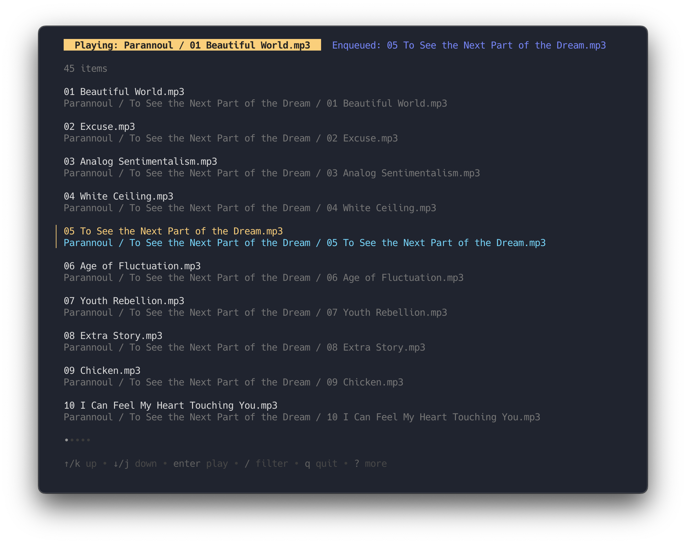

<br/><br/>
<div>
    <h3 align="center">🎐 Chime</h3>
    <p align="center">
        A simple command line player for your digitally downloaded music. 
    </p>
    <p align="center">
        
    </p>
</div>


## Getting Started

### Prerequisites

Install [Go](https://go.dev) if it's not already installed.

### Installation
```sh
go install github.com/williamfedele/chime/cmd/chime@latest
```

## Usage

Until a proper configuration system is in place, the root directory of your music library must be provided as an argument.
```sh
chime /path/to/your/music/library/root
```

### Keybinds

Keybinds can be found in the help view at the bottom of the terminal. It can be expanded using `?` to show the full keybind list.

Apart from the Vim-like movement, the following keybinds are set for manipulating the music player:

- `enter`: Plays the currently highlighted song.
- `space`: Toggles the playback between play/pause.
- `x`: Stops all playback and clears the queue.
- `S`: Shuffles all songs and plays the first.
- `a`: Adds the currently highlighted song to the queue.
- `s`: Skip the currently playing song.


## Development

This was a big learning experience about concurrent Go and it's likely got bugs. I'm still working on this so I'll keep hunting them down as I add new features. 

I'd like to add the following soon:

- Proper configuration system
- More controls over the playback such as volume


## License

[MIT](https://github.com/williamfedele/chime/blob/main/LICENSE)


## Acknowledgments

* [Charmbracelet](https://github.com/charmbracelet) for their incredibly cool CLI tools.
